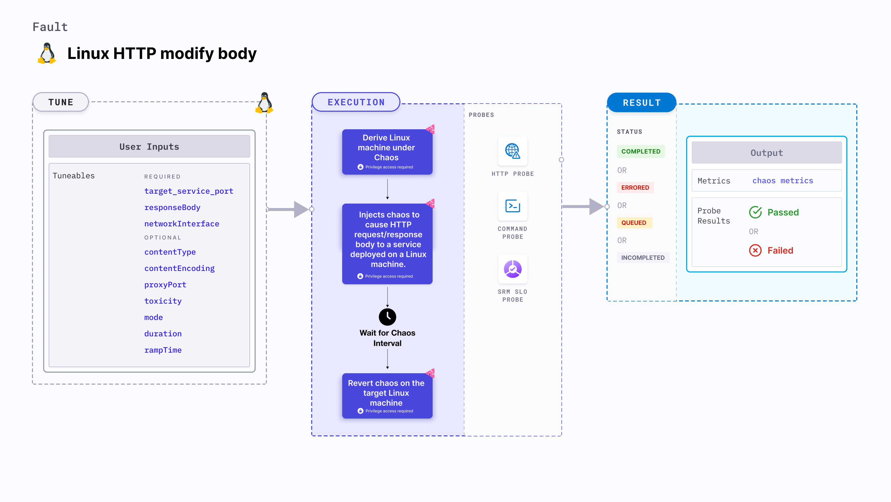

import Ossupport from './shared/note-supported-os.md'
import FaultPermissions from './shared/fault-permissions.md'

Linux HTTP modify body injects chaos to cause HTTP request/response body for a service to be modified on a Linux machine.

<!--  -->

## Use cases

- Evaluates the application's resilience to lossy or flaky HTTP responses.
- Simulates latency to specific API services for (or from) a given service.
- Simulates a slow response on specific third-party or dependent components or services.

<Ossupport />

<FaultPermissions />

## Fault tunables
<h3>Mandatory tunables</h3>
<table>
  <tr>
    <th> Tunable </th>
    <th> Description </th>
    <th> Notes </th>
  </tr>
   <tr>
      <td> targetServicePort </td>
      <td> Port of the target service. </td>
      <td> Default: <code>80</code>. </td>
    </tr>
    <tr>
      <td> responseBody </td>
      <td> String body to overwrite the HTTP response body. </td>
      <td> If no value is provided, response will be an empty body. Defaults to empty body. </td>
    </tr>
    <tr>
      <td> networkInterface </td>
      <td> Network interface used by the target service. </td>
      <td> For example: <code>eth0</code> </td>
    </tr>
</table>
<h3>Optional tunables</h3>
<table>
  <tr>
    <th> Tunable </th>
    <th> Description </th>
    <th> Notes </th>
  </tr>
  <tr>
    <td> contentType </td>
    <td> Content type of the response body. </td>
    <td> Default: text or plain. </td>
  </tr>
  <tr>
    <td> contentEncoding </td>
    <td> Encoding type to compress or encode the response body. </td>
    <td> Default: None (no encoding). Accepted values include gzip, deflate, br, identity. </td>
  </tr>
  <tr>
    <td> proxyPort </td>
    <td> Port where the proxy listens for requests. </td>
    <td> Default: <code>20000</code>. </td>
  </tr>
  <tr>
    <td> toxicity </td>
    <td> Percentage of HTTP requests to be affected. </td>
    <td> Default: <code>100</code>. </td>
  </tr>
  <tr>
    <td> mode </td>
    <td> Can be either <code>request</code> or <code>response</code>. Corresponds to whether to inject chaos into the HTTP requests or responses. </td>
    <td> Default: <code>response</code> </td>
  </tr>
  <tr>
    <td> duration </td>
    <td> Duration through which chaos is injected into the target resource (in seconds). </td>
    <td> Default: 30s </td>
  </tr>
  <tr>
    <td> rampTime </td>
    <td> Period to wait before and after injecting chaos (in seconds). </td>
    <td> Default: 0s </td>
  </tr>
</table>

### Target service port

Port of the target service. Tune it by using the `targetServicePort` environment variable.

The following YAML snippet illustrates the use of this environment variable:

[embedmd]:# (./static/manifests/linux-http-modify-body/targetServicePort.yaml yaml)
```yaml
# target service port as https port 443
apiVersion: litmuchaos.io/v1alpha1
kind: LinuxFault
metadata:
  name: linux-http-modify-body
  labels:
    name: http-modify-body
spec:
  httpChaos/inputs:
    duration: 30
    networkInterface: "ens4"
    targetServicePort: 443
```

### Proxy port

Port on which the proxy server listens for requests. Tune it by using the `proxyPort` environment variable.

The following YAML snippet illustrates the use of this environment variable:

[embedmd]: # (./static/manifests/linux-http-modify-body/proxyPort.yaml yaml)
```yaml
# port for the proxy server
apiVersion: litmuchaos.io/v1alpha1
kind: LinuxFault
metadata:
  name: linux-http-modify-body
  labels:
    name: http-modify-body
spec:
  httpChaos/inputs:
    duration: 30
    networkInterface: "ens4"
    targetServicePort: 443
    proxyPort: 32045
```

### Mode
Specifies whether whether the chaos should be added to the HTTP request or response. Tune it by using the `mode` environment variable.

The following YAML snippet illustrates the use of this environment variable:

[embedmd]:# (./static/manifests/linux-http-modify-body/mode.yaml yaml)
```yaml
## provide the mode; request/response
apiVersion: litmuchaos.io/v1alpha1
kind: LinuxFault
metadata:
  name: linux-http-modify-body
  labels:
    name: http-modify-body
spec:
  httpChaos/inputs:
    duration: 30
    networkInterface: "ens4"
    targetServicePort: 443
    mode: response
```

### Toxicity

Percentage of the total number of HTTP requests to be affected. Tune it by using the `toxicity` environment variable.

The following YAML snippet illustrates the use of this environment variable:

[embedmd]: # (./static/manifests/linux-http-modify-body/toxicity.yaml yaml)
```yaml
# provide the toxicity
apiVersion: litmuchaos.io/v1alpha1
kind: LinuxFault
metadata:
  name: linux-http-modify-body
  labels:
    name: http-modify-body
spec:
  httpChaos/inputs:
    duration: 30
    networkInterface: "ens4"
    targetServicePort: 443
    toxicity: 50
```

### Response body
String body that overwrites the HTTP response body. Tune it by using the `responseBody` environment variable.

The following YAML snippet illustrates the use of this environment variable:

[embedmd]: # (./static/manifests/linux-http-modify-body/responseBody.yaml yaml)
```yaml
# provide the response body value
apiVersion: litmuchaos.io/v1alpha1
kind: LinuxFault
metadata:
  name: linux-http-modify-body
  labels:
    name: http-modify-body
spec:
  httpChaos/inputs:
    duration: 30
    networkInterface: "ens4"
    targetServicePort: 443
    responseBody: "modified body"
```

### Content encoding and content type

Content encoding and content type of the response body. Tune it by using the `contentEncoding` and `contentType` environment variables, respectively.

The following YAML snippet illustrates the use of these environment variables:

[embedmd]: # (./static/manifests/linux-http-modify-body/modify-body-with-encoding-type.yaml yaml)
```yaml
# provide the content encoding and content type
apiVersion: litmuchaos.io/v1alpha1
kind: LinuxFault
metadata:
  name: linux-http-modify-body
  labels:
    name: http-modify-body
spec:
  httpChaos/inputs:
    duration: 30
    networkInterface: "ens4"
    targetServicePort: 443
    responseBody: "modified body"
    contentType: "text/html"
    contentEncoding: "gzip"
```

### Network interface

Network interface used by the target service. Tune it by using the `networkInterface` environment variable.

The following YAML snippet illustrates the use of this environment variable:

[embedmd]: # (./static/manifests/linux-http-modify-body/networkInterface.yaml yaml)
```yaml
# network interface for the target service
apiVersion: litmuchaos.io/v1alpha1
kind: LinuxFault
metadata:
  name: linux-http-modify-body
  labels:
    name: http-modify-body
spec:
  httpChaos/inputs:
    duration: 30
    networkInterface: "ens4"
```
