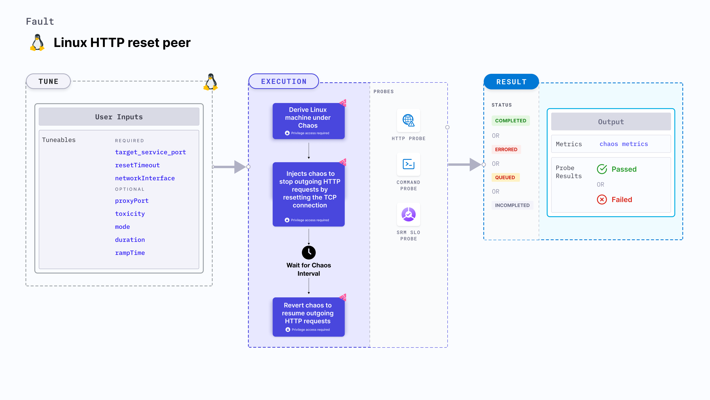

import Ossupport from './shared/note-supported-os.md'
import FaultPermissions from './shared/fault-permissions.md'


Linux HTTP reset peer injects chaos to stop outgoing HTTP requests by resetting the TCP connection. This is achieved by starting the proxy server and redirecting the request/response traffic through the proxy server.

<!--  -->

## Use cases
- Tests the application's resilience to lossy or flaky HTTP connection.
- Simulates premature connection loss that may occur due to firewall issues or other issues between microservices thereby verifying connection timeout.
- Simulates connection resets due to resource limitations on the server side such as out of memory error, process kills, overload on the server due to high amounts of traffic.

<Ossupport />

<FaultPermissions />

## Fault tunables
<h3>Mandatory tunables</h3>
<table>
  <tr>
    <th> Tunable </th>
    <th> Description </th>
    <th> Notes </th>
  </tr>
   <tr>
      <td> targetServicePort </td>
      <td> Port of the target service. </td>
      <td> Default: <code>80</code>. </td>
    </tr>
    <tr>
      <td> resetTimeout </td>
      <td> Specifies the duration after which connection needs to be reset. </td>
      <td> Default: 0. </td>
    </tr>
    <tr>
      <td> networkInterface </td>
      <td> Network interface used by the target service. </td>
      <td> If no value is provided, response will be an empty body. </td>
    </tr>
</table>
<h3>Optional tunables</h3>
<table>
  <tr>
    <th> Tunable </th>
    <th> Description </th>
    <th> Notes </th>
  </tr>
  <tr>
    <td> proxyPort </td>
    <td> Port where the proxy listens for requests. </td>
    <td> Default: <code>20000</code>. </td>
  </tr>
  <tr>
    <td> toxicity </td>
    <td> Percentage of HTTP requests to be affected. </td>
    <td> Default: <code>100</code>. </td>
  </tr>
  <tr>
    <td> mode </td>
    <td> Can be either <code>request</code> or <code>response</code>. Corresponds to whether to inject chaos into the HTTP requests or responses. </td>
    <td> Default: <code>response</code> </td>
  </tr>
  <tr>
    <td> duration </td>
    <td> Duration through which chaos is injected into the target resource (in seconds). </td>
    <td> Default: 30s </td>
  </tr>
  <tr>
    <td> rampTime </td>
    <td> Period to wait before and after injecting chaos (in seconds). </td>
    <td> Default: 0s </td>
  </tr>
</table>

### Target service port

Port of the target service. Tune it by using the `targetServicePort` environment variable.

The following YAML snippet illustrates the use of this environment variable:

[embedmd]:# (./static/manifests/linux-http-reset-peer/targetServicePort.yaml yaml)
```yaml
# target service port as https port 443
apiVersion: litmuchaos.io/v1alpha1
kind: LinuxFault
metadata:
  name: linux-http-reset-peer
  labels:
    name: http-reset-peer
spec:
  httpChaos/inputs:
    duration: 30
    networkInterface: "ens4"
    targetServicePort: 443
```

### Proxy port

Port on which the proxy server listens for requests. Tune it by using the `proxyPort` environment variable.

The following YAML snippet illustrates the use of this environment variable:

[embedmd]: # (./static/manifests/linux-http-reset-peer/proxyPort.yaml yaml)
```yaml
# port for the proxy server
apiVersion: litmuchaos.io/v1alpha1
kind: LinuxFault
metadata:
  name: linux-http-reset-peer
  labels:
    name: http-reset-peer
spec:
  httpChaos/inputs:
    duration: 30
    networkInterface: "ens4"
    targetServicePort: 443
    proxyPort: 32045
```

### Mode
Specifies whether whether the chaos should be added to the HTTP request or response. Tune it by using the `mode` environment variable.

The following YAML snippet illustrates the use of this environment variable:

[embedmd]:# (./static/manifests/linux-http-reset-peer/mode.yaml yaml)
```yaml
## provide the mode; request/response
apiVersion: litmuchaos.io/v1alpha1
kind: LinuxFault
metadata:
  name: linux-http-reset-peer
  labels:
    name: http-reset-peer
spec:
  httpChaos/inputs:
    duration: 30
    networkInterface: "ens4"
    targetServicePort: 443
    mode: response
```

### Toxicity

Percentage of the total number of HTTP requests to be affected. Tune it by using the `toxicity` environment variable.

The following YAML snippet illustrates the use of this environment variable:

[embedmd]: # (./static/manifests/linux-http-reset-peer/toxicity.yaml yaml)
```yaml
# provide the toxicity
apiVersion: litmuchaos.io/v1alpha1
kind: LinuxFault
metadata:
  name: linux-http-reset-peer
  labels:
    name: http-reset-peer
spec:
  httpChaos/inputs:
    duration: 30
    networkInterface: "ens4"
    targetServicePort: 443
    toxicity: 50
```

### Reset timeout

Duration after which connection is reset. Tune it by using the `resetTimeout` environment variable.

The following YAML snippet illustrates the use of this environment variable:

[embedmd]: # (./static/manifests/linux-http-reset-peer/resetTimeout.yaml yaml)

```yaml
# provide the reset timeout value
apiVersion: litmuchaos.io/v1alpha1
kind: LinuxFault
metadata:
  name: linux-http-reset-peer
  labels:
    name: http-reset-peer
spec:
  httpChaos/inputs:
    duration: 30
    networkInterface: "ens4"
    targetServicePort: 443
    resetTimeout: 500
```

### Network interface

Network interface used by the target service. Tune it by using the `networkInterface` environment variable.

The following YAML snippet illustrates the use of this environment variable:

[embedmd]: # (./static/manifests/http-reset-peer/networkInterface.yaml yaml)
```yaml
# network interface for the target service
apiVersion: litmuchaos.io/v1alpha1
kind: LinuxFault
metadata:
  name: linux-http-reset-peer
  labels:
    name: http-reset-peer
spec:
  httpChaos/inputs:
    duration: 30
    networkInterface: "ens4"
```
