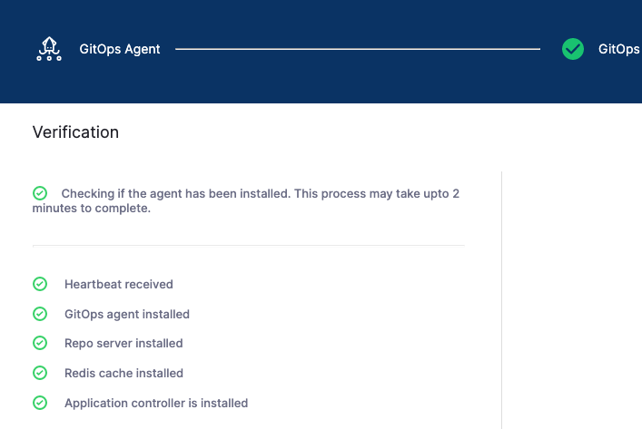
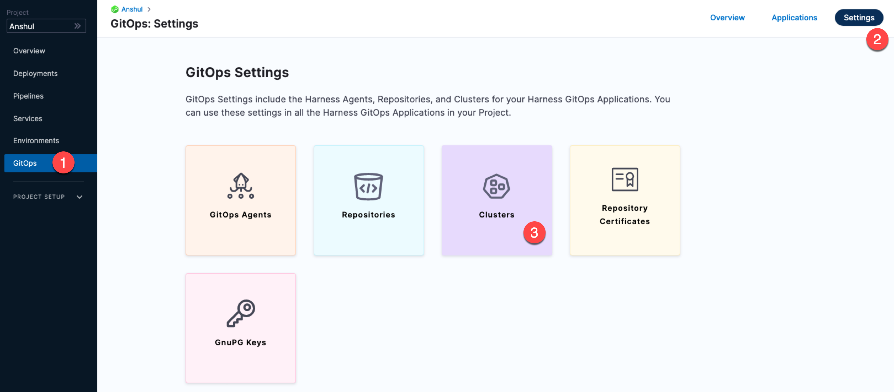
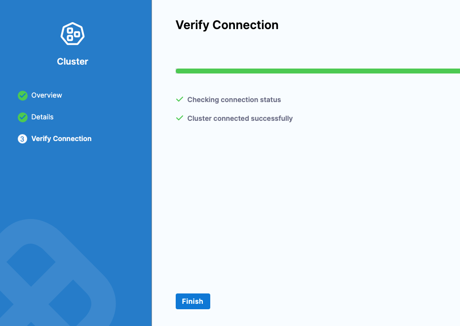
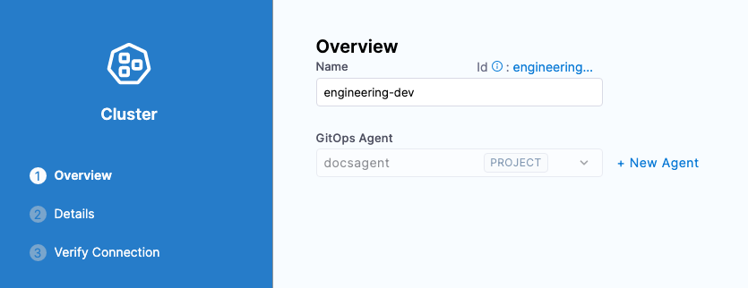
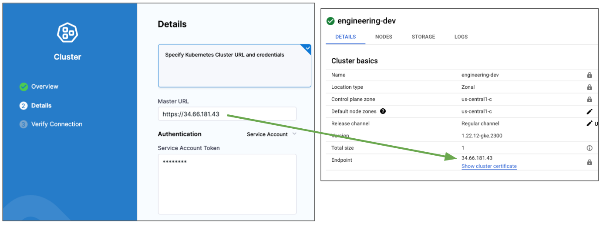
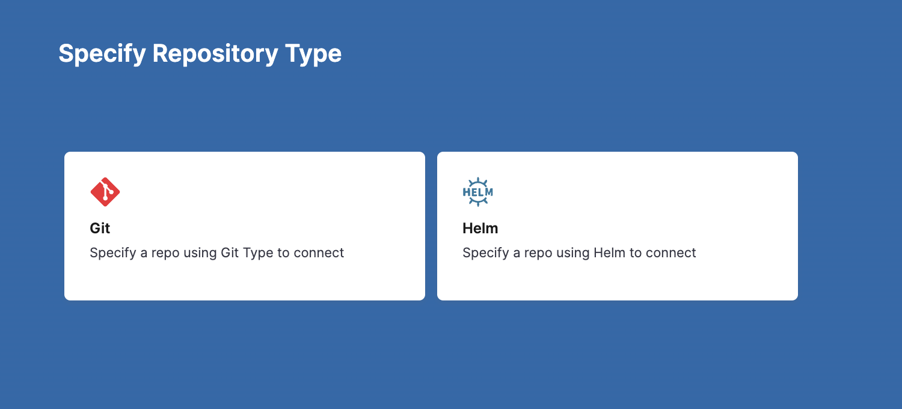
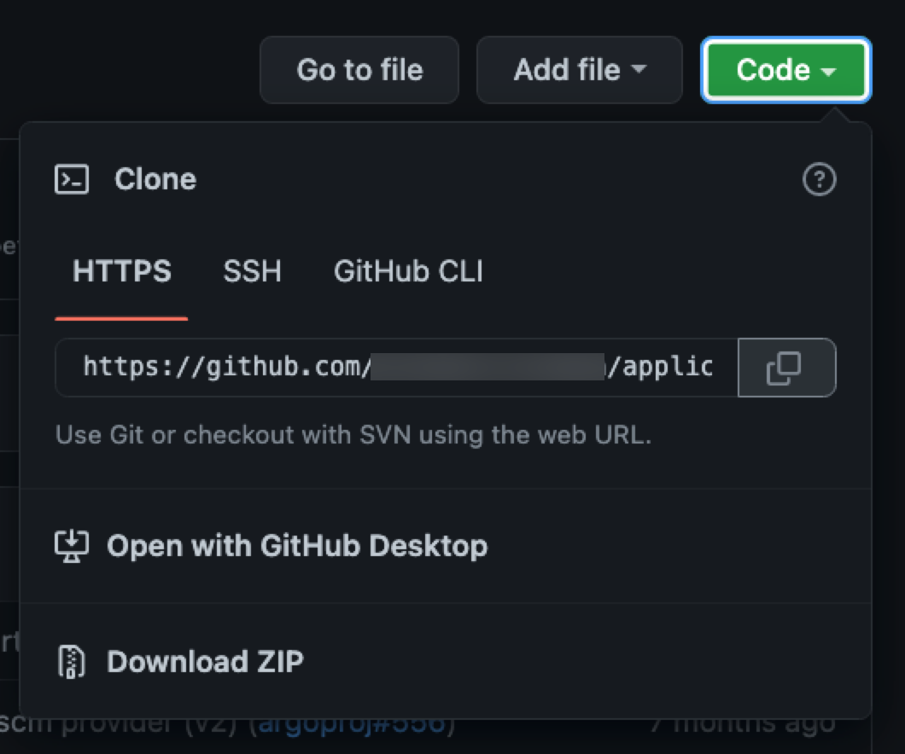
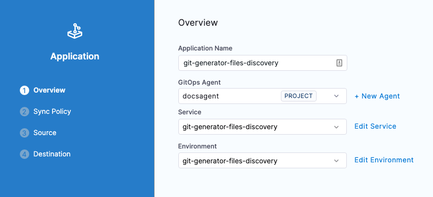

A typical GitOps Application syncs a source manifest to a destination cluster. If you have multiple target clusters, you could create separate GitOps Applications for each one, but that makes management more challenging. What if you want to sync an application with 100s of target clusters? Managing 100s of GitOps Applications is not easy.

To solve this use case, we can explore ApplicationSets.

ApplicationSet can be thought of as a kind of Application factory. It defines one application template and syncs it to multiple target environments. It is similar to an Application but uses a template to achieve application automation with multiple target environments.

ApplicationSet CRD is managed by dedicated kubernetes controller - applicationset-controller similar to Application CRD being managed by application-controller.

ApplicationSets offer the following capabilities:

* Use a single manifest to target multiple Kubernetes clusters.
* Use a single manifest to deploy multiple Applications from a single or multiple git repositories.
* Enhanced support for the monorepos, where multiple Application resources are defined within a single Git repository.

You can find more information about ApplicationSets from the [ApplicationSets documentation site](https://argocd-applicationset.readthedocs.io/en/stable/).

<details>
<summary>ApplicationSets and PR pipelines summary</summary>

A typical GitOps Application syncs a source manifest to a destination cluster. If you have multiple target clusters, you could create separate GitOps Applications for each one, but that makes management more challenging. Also, what if you want to sync an application with 100s of target clusters? Managing 100s of GitOps Applications is not acceptable.

To solve this use case, Harness supports ApplicationSets.

### ApplicationSets

An ApplicationSet uses an ApplicationSet controller to automatically and dynamically generate applications in multiple target environments. A GitOps ApplicationSet is similar to a GitOps Application but uses a template to achieve application automation using multiple target environments.

ApplicationSet is supported in your cluster using a [Kubernetes controller](https://kubernetes.io/docs/concepts/architecture/controller/) for the `ApplicationSet` [CustomResourceDefinition](https://kubernetes.io/docs/tasks/extend-kubernetes/custom-resources/custom-resource-definitions/) (CRD). You add an ApplicationSet manifest to a Harness GitOps Application just like you would add a typical Deployment manifest. At runtime, Harness uses the ApplicationSet to deploy the application to all the target environments' clusters.


#### Template parameters

ApplicationSets use generators to generate parameters that are substituted into the `template:` section of the ApplicationSet resource during template rendering.

There are many types of generators. For the list, go to [Generators](https://argocd-applicationset.readthedocs.io/en/stable/Generators/) from Argo CD docs.Generators support parameters in the format `{{parameter name}}`.

For example, here's the template section of a guestbook List generator that uses `{{cluster.name}}` and `{{cluster.address}}`:


```yaml
  template:  
    metadata:  
      name: '{{cluster.name}}-guestbook'  
    spec:  
      project: 191b68fc  
      source:  
        repoURL: https://github.com/johndoe/applicationset.git  
        targetRevision: HEAD  
        path: "examples/git-generator-files-discovery/apps/guestbook"  
      destination:  
        server: '{{cluster.address}}'  
        namespace: default  
      syncPolicy:  
        automated: {}
```

The values for these parameters will be taken from the cluster list config.json `cluster.name` and `cluster.address`:

```yaml
{  
  "releaseTag" : "k8s-v0.4",  
  "cluster" : {  
    "owner" : "cluster-admin@company.com",  
    "address" : "https://34.133.127.118",  
    "name" : "dev"  
  },  
  "asset_id" : "12345678"  
}
```

After substitution, this guestbook ApplicationSet resource is applied to the Kubernetes cluster:

```yaml
apiVersion: argoproj.io/v1alpha1  
kind: Application  
metadata:  
  name: dev-guestbook  
spec:  
  source:  
    repoURL: https://github.com/johndoe/applicationset.git  
    path: examples/git-generator-files-discovery/apps/guestbook  
    targetRevision: HEAD  
  destination:  
    server: https://34.133.127.118  
    namespace: default  
  project: 191b68fc  
  syncPolicy:  
    automated: {}
```

### PR Pipelines

Often, even though your ApplicationSet syncs one microservice/application to multiple target environments, you might want to change a microservice in just one of the target environments, such as a dev environment. A Harness PR Pipeline enables you to do this.

When you deploy a Harness PR Pipeline, you simply indicate what target environment application you want to update and the config.json keys/values you want changed, such as release tags. Harness creates the pull request in your Git repo and merges it for you. Now, the target environment application has the new keys/values.


#### Wave deployments

You often hear the term wave deployments used when PR Pipelines are discussed.

A wave deployment is a deployment strategy in Continuous Delivery that involves releasing changes to a portion of users at a time, rather than all users at once. Typically, this is done using separate cloud regions for each target environment.

Wave deployments help reduce the risk of deployment failures and allow for quick recovery. The changes are rolled out in waves, typically starting with a group of users in one region and gradually expanding to the entire user base across all regions. This approach allows for a more controlled and monitored rollout of changes, improving the overall quality and stability of the deployment process.

With Harness GitOps, you can implement wave deployments by creating multiple environments for your application: one environment for each cloud region. Then, gradually promote changes from one environment to the next. This way, you can test changes in a safe and controlled manner before releasing them to the entire user base.

PR Pipelines support the wave deployments practice by allowing you to change a microservice in each target environment as needed.

</details>


## Before you begin

This topic extends Harness GitOps features covered in the following topics:

* [Harness GitOps Basics](/docs/continuous-delivery/gitops/get-started/harness-git-ops-basics.md)
* [Harness CD GitOps Tutorial](/docs/continuous-delivery/gitops/get-started/harness-cd-git-ops-quickstart.md)

Review these topics before proceeding.

## ApplicationSet requirements

To set up a typical ApplicationSet use case, you'll need the following:

* 3 Kubernetes clusters with a minimum of 2 vCPUs, 8GB Memory, 100 GB disk size (for example the [e2-standard-2](https://cloud.google.com/compute/docs/general-purpose-machines#e2_limitations) in GCP):
	+ 2 target clusters: the ApplicationSet will deploy an app to these 2 clusters.
		- For this tutorial, we will name the clusters **engineering-dev** and **engineering-prod**.  
		We will use the Kubernetes default namespace for the applications, but you can use any namespace.
	- 1 cluster for the Harness GitOps Agent. You can install the Agent in a cluster with or without an existing Argo CD project.
* GitHub account. You will be cloning the Argo Project's [ApplicationSet repo](https://github.com/argoproj/applicationset) and using one of its examples.

## Install a GitOps Agent

For steps on how to install a Harness GitOps Agent, go to [Install a Harness GitOps Agent](/docs/continuous-delivery/gitops/use-gitops/install-a-harness-git-ops-agent.md).

1. Install the Agent in the Kubernetes cluster you have set up for your GitOps Agent, not the target dev or prod target clusters.

Ensure the Agent has access to Harness and to the other 2 target clusters. Once it's installed you'll see it register with Harness:



:::note

**Mapped Harness Project:** if you installed the Agent in a cluster without an existing Argo CD project, there will not be a mapping initially. Once you create a Harness GitOps entity using the Agent, such as a GitOps Cluster or Repo, Harness will automatically create the Argo CD project and map it to the Agent.

:::

## Add the GitOps Clusters

Now we'll add 3 GitOps Clusters in Harness:

* 1 GitOps Cluster for the cluster running your GitOps Agent.
* 1 GitOps Cluster for the cluster that will host the dev application.
* 1 GitOps Cluster for the cluster that will host the prod application.

### GitOps Agent Cluster

1. In **GitOps**, click **Settings**, and then **Clusters**.
   
   

2. Click **New Cluster**.
3. In **Name**, enter the name **appset-example**.
4. In **GitOps Agent**, select the Agent you installed earlier.
5. Click **Continue**.
6. In **Details**, click **Use the credentials of a specific Harness GitOps Agent**.
7. Click **Save and Continue**.
   The connections is verified.
   
   

8. Click **Finish**.

### Dev and Prod Application Clusters

We'll add Harness GitOps Clusters for the two target clusters where we want to add our application.

1. Create a new Harness GitOps Cluster for your dev cluster.
2. Name the cluster **engineering-dev**.
3. In **GitOps Agent**, select the GitOps Agent you added earlier.
   
   

4. In **Details**, select **Specify Kubernetes Cluster URL and credentials**.
5. In **Master URL**, enter the Endpoint URL for the target cluster (you can use `kubectl cluster-info` or your cloud console). Ensure that you use the `https://` scheme.Here's an example:
   
   

6. In **Authentication**, use the authentication method you prefer. In this tutorial, we use the `default` namespace `service-account` token.
7. Click **Save and Continue**. The GitOps Cluster is verified.
8. Click **Finish**.
9.  Repeat the process for the **Prod** cluster.
	1. Name the cluster **engineering-prod**.
	2. Use the same Agent.
	3. For **Master URL**, ensure that you use the `https://` scheme.
	4. Use whatever authentication method you want.

When you're done, you will have three Harness GitOps Clusters: 1 for the GitOps Agent and two for the target clusters.


You might see a Warning status. This status simply indicates that nothing has been deployed to the cluster yet.

## Clone and update the ApplicationSet repo

The repo and example we will use is located in the Argo Project's public [ApplicationSet repo](https://github.com/argoproj/applicationset):

`https://github.com/argoproj/applicationset/tree/master/examples/git-generator-files-discovery`

For a summary of this example, go to [Argo CD docs](https://argocd-applicationset.readthedocs.io/en/stable/Generators-Git/#git-generator-files). You will need to clone this repo into your GitHub account and then update 3 files.

1. Clone the repo `https://github.com/argoproj/applicationset`.
2. Navigate to `applicationset/examples/git-generator-files-discovery/git-generator-files.yaml`.
3. Update `git-generator-files.yaml` with the following YAML keys/values:


```yaml
apiVersion: argoproj.io/v1alpha1  
kind: ApplicationSet  
metadata:  
  name: guestbook  
spec:  
  generators:  
    - git:  
        repoURL: https://github.com/<your account name>/applicationset.git  
        revision: HEAD  
        files:  
        - path: "examples/git-generator-files-discovery/cluster-config/**/config.json"  
  template:  
    metadata:  
      name: '{{cluster.name}}-guestbook'  
    spec:  
      project: <Harness GitOps Agent Project Id>  
      source:  
        repoURL: https://github.com/<your account name>/applicationset.git  
        targetRevision: HEAD  
        path: "examples/git-generator-files-discovery/apps/guestbook"  
      destination:  
        server: '{{cluster.address}}'  
        namespace: default  
      syncPolicy:  
        automated: {}
```
Make sure you update the following:

1. Update `repoURL: https://github.com/argoproj/applicationset.git` with `repoURL: https://github.com/<your account name>/applicationset.git`.
2. `spec.template.spec.project`: replace `default` with the Harness GitOps Agent Project Id.
3. `spec.template.spec.destination.server`: replace `server: https://kubernetes.default.svc` with `server: '{{cluster.address}}'`.
4. Add `syncPolicy.automated: {}` to `spec.template.spec`.
   
   

5. Save your changes.

Next, we'll update the config.json files for the two target clusters.

1. Navigate to `applicationset/examples/git-generator-files-discovery/cluster-config/engineering/dev/config.json`.
2. Replace `"address": "https://1.2.3.4"` with the Endpoint IP address for the **dev** cluster. Ensure that you use the `https://` scheme.
3. Navigate to `applicationset/examples/git-generator-files-discovery/cluster-config/engineering/prod/config.json`.
4. Replace `"address": "https://1.2.3.4"` with the Endpoint IP address for the **prod** cluster. Ensure that you use the `https://` scheme.

Here's an example. Your IP addresses will be different.


## Add the GitOps Repository

Let's add a Harness GitOps Repository for your ApplicationSet repo. Later, you'll select this GitOps Repository when you set up the Harness GitOps Application.

1. In your Harness Project, click **GitOps**, and then click **Settings**.
2. Click **Repositories**.
3. Click **New Repository**.
   
   

4. In **Specify Repository Type**, click **Git**.
5. Enter the following and click **Continue**.
   * **Repository Name:** **applicationset\_examples**.
   * **GitOps Agent:** select the Agent you added earlier.
   * **Git Repository URL:** the URL to your repo. You can simply copy and paste the HTTPS URL from GitHub.
   
   

   1. In **Credentials**, either user your GitHub credentials or, if your repo is public, select Anonymous in Authentication.
   2. Click **Save & Continue**.
6. Once the connection is verified, click **Finish**.

Now you can create the Harness GitOps Application using the Harness GitOps Agent, Clusters, and Repositories you have set up.

## Create the Harness GitOps Application

Now that we have the Agent, Clusters, and Repo, we can create the GitOps Application.

1. In **GitOps**, click **Applications**, and then click **New Application**.
2. Enter the following settings and then click **Continue**.
	1. **Application Name:** enter **git-generator-files-discovery**.
	2. **GitOps Agent:** select the Agent you added earlier.
	3. **Service:** create a new Service named **git-generator-files-discovery**.
	4. **Environment:** create a new Environment named **git-generator-files-discovery**. 
	5. Select **Pre-Production**.
   
   

3. Leave the default **Sync Policy** settings, and click **Continue**.
4. In **Source**, enter the following settings and then click **Continue**.
	1. **Repository URL:** select the GitOps Repository you added earlier.
	2. **Target Revision:** select **master**.
	3. **Path:** enter **examples/git-generator-files-discovery** and click **+** to add it.
   
   

5. In **Destination**, enter the following settings and then click **Finish**.
	1. **Cluster:** select the Agent cluster **appset-example**.
	2. Namespace: enter **default**.

The GitOps Application is added. Now you can [sync](/docs/continuous-delivery/gitops/use-gitops/sync-gitops-applications) it.

## Notes

### ApplicationSet Support

* Do not deploy an ApplicationSet in a namespace other than the namespace where the GitOps Agent is installed. The ApplicationResource has to be deployed in same namespace as the GitOps Agent.
* Harness supports both JSON and YAML formats for ApplicationSets.
* Harness supports all ApplicationSet generators. You can add an ApplicationSet for any generator as an Application in Harness:
	+ [List Generator](https://argocd-applicationset.readthedocs.io/en/stable/Generators-List/)
	+ [Cluster Generator](https://argocd-applicationset.readthedocs.io/en/stable/Generators-Cluster/)
	+ [Git Generator](https://argocd-applicationset.readthedocs.io/en/stable/Generators-Git/)
	+ [Matrix Generator](https://argocd-applicationset.readthedocs.io/en/stable/Generators-Matrix/)
	+ [Merge Generator](https://argocd-applicationset.readthedocs.io/en/stable/Generators-Merge/)
	+ [SCM Provider Generator](https://argocd-applicationset.readthedocs.io/en/stable/Generators-SCM-Provider/)
	+ [Cluster Decision Resource Generator](https://argocd-applicationset.readthedocs.io/en/stable/Generators-Cluster-Decision-Resource/)
	+ [Pull Request Generator](https://argocd-applicationset.readthedocs.io/en/stable/Generators-Pull-Request/)
* [Git Generator](https://argocd-applicationset.readthedocs.io/en/stable/Generators-Git/) has first class support with the **Update Release Repo** and **Merge PR** steps in the Pipeline.
* All generators can be used in Shell Script steps. For example, you could create a Cluster generator YAML spec in a Shell Script step as a bash variable, and then use git commands in the script to update the ApplicationSet in your repo with the spec in the step. The updated repo spec will be used in the next Application sync (manual or automatic).

### Syncing

You can sync using the Harness ApplicationSet Application or sync the individual Harness Applications independently.


If you configure automatic syncing in the ApplicationSet template, then the Applications will be synced automatically. See `syncPolicy.automated` here:


```yaml
  template:  
    metadata:  
      name: '{{cluster.name}}-guestbook'  
    spec:  
      project: 191b68fc  
      source:  
        repoURL: https://github.com/johndoe/applicationset.git  
        targetRevision: HEAD  
        path: "examples/git-generator-files-discovery/apps/guestbook"  
      destination:  
        server: '{{cluster.address}}'  
        namespace: default  
      syncPolicy:  
        automated: {}
```

The `syncPolicy.automated` is applied to all Applications created by the ApplicationSet because it is part of the template.

If you make a change to one of the target Applications and then perform an ApplicationSet sync, the change to target Application will be preserved.

